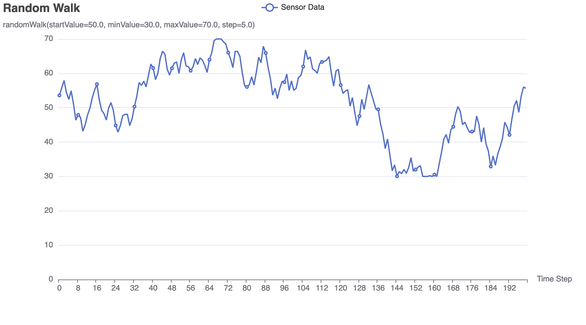
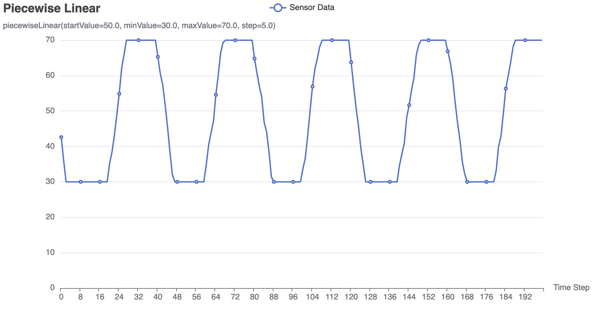
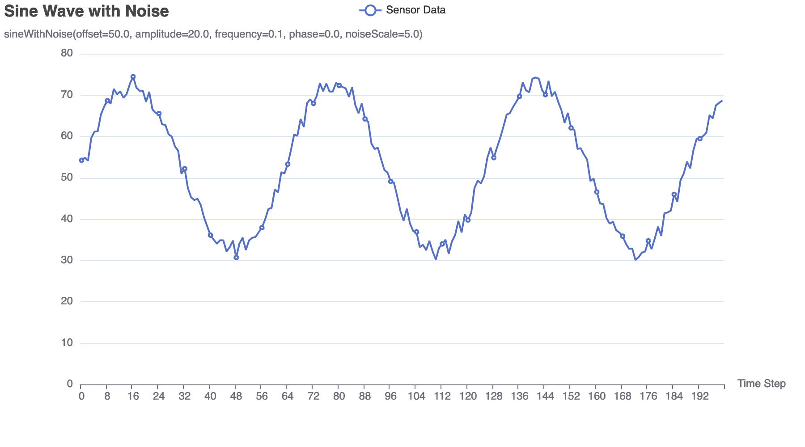
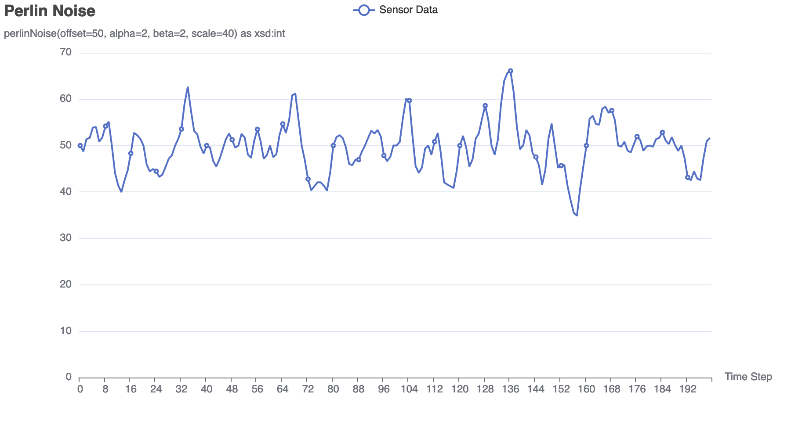

# Noise Generators

The `noise` package provides various algorithms to generate sequences of values
that simulate sensor readings with different patterns. These generators can be
used to create realistic test data for applications that process sensor data.

## Usage

Add a special parameter to the datamodel file with type `sim:generator` and a
value that follows the syntax described here.

### Random Walk

The `randomWalk` algorithm generates a sequence of values where each value is
derived from the previous one by adding a small random change. This simulates a
sensor that produces readings which vary in a random but continuous manner.

```
randomWalk(startValue=50, minValue=30, maxValue=70, step=5) as xsd:int
```

- `startValue`: The initial value of the sequence.
- `minValue`: The minimum value the sequence can take.
- `maxValue`: The maximum value the sequence can take.
- `step`: The maximum change between consecutive values.



### Piecewise Linear

The `piecewiseLinear` algorithm generates a sequence of values where the trend
changes direction at regular intervals. This simulates a sensor that produces
readings which follow a piecewise linear pattern, with occasional random
fluctuations.

```
piecewiseLinear(startValue=50, minValue=30, maxValue=70, step=5) as xsd:int
```

- `startValue`: The initial value of the sequence.
- `minValue`: The minimum value the sequence can take.
- `maxValue`: The maximum value the sequence can take.
- `step`: The maximum change between consecutive values.



### Sine Wave with Noise

The `sineWithNoise` algorithm generates a sequence of values based on a sine
wave with added random noise. This simulates a sensor that produces readings
which follow a sinusoidal pattern with some random fluctuations.

```
sineWithNoise(offset=50, amplitude=20, frequency=0.1, phase=0, noiseScale=5) as xsd:int
```

- `offset`: The baseline value of the sine wave.
- `amplitude`: The peak value of the sine wave.
- `frequency`: The number of cycles the sine wave completes in a unit time.
- `noiseScale`: The level of random noise added to the sine wave.



### Perlin Noise

The `perlinNoise` algorithm generates a sequence of values based on Perlin
noise. This simulates a sensor that produces readings which follow a smooth,
natural pattern.

```
perlinNoise(offset=50, alpha=2, beta=2, scale=40) as xsd:int
```

- `alpha`: Controls the smoothness of the Perlin noise. Higher values make the
  noise smoother.
- `beta`: Controls the frequency of the Perlin noise. Higher values increase the
  frequency.
- `scale`: A scaling factor to adjust the amplitude of the noise.
- `offset`: A constant value to be added to the generated noise values.



## Experimenting

To experiment with the noise generator output and find the best algorithm and
parameters for simulating your sensor, modify the `example_test.go` file and
generate previews using the following command:

```
go test -tags=preview -v ./datamodel/noise -run TestGeneratePreviews
```

## Performance

All generator algorithms are efficient and performance should not be a concern.
To evaluate performance on your hardware, run the benchmarks using the following
command:

```
go test -bench=. ./datamodel/noise
```

```
goos: darwin
goarch: arm64
pkg: github.com/localhots/SimulaTR69/datamodel/noise
cpu: Apple M3 Pro
BenchmarkRandomWalk-11         	193095481	         6.242 ns/op
BenchmarkPiecewiseLinear-11    	165025899	         7.235 ns/op
BenchmarkSineWithNoise-11      	100000000	        10.87 ns/op
BenchmarkPerlinNoise-11        	129291402	         9.257 ns/op
```
